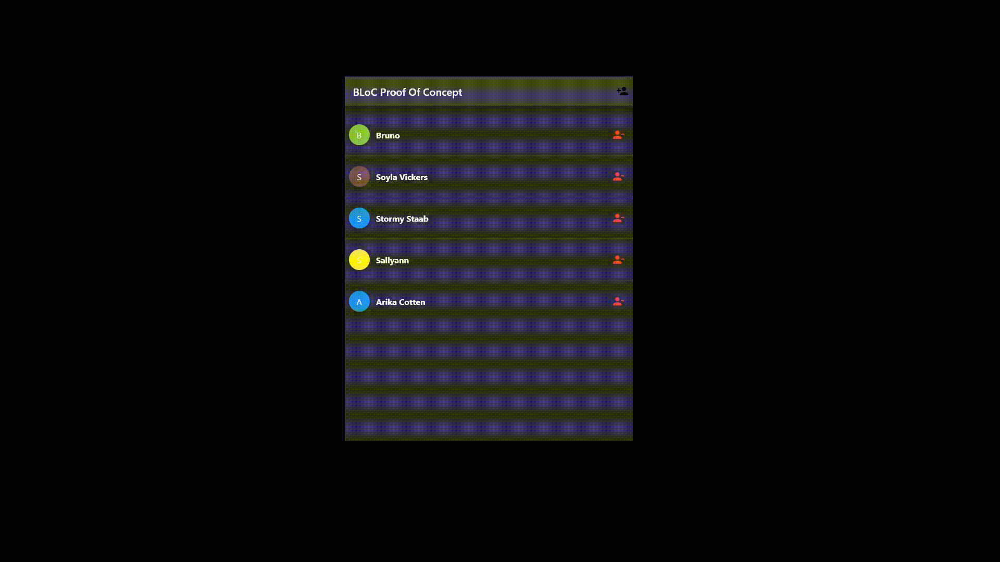

# Flutter BLoC Implementation

BLoC Pattern implementation example.

* Based on [video](https://www.youtube.com/watch?v=UukgrBIf3Cc)
* Example of [BLoC](https://bloclibrary.dev/#/fluttertimertutorial)
